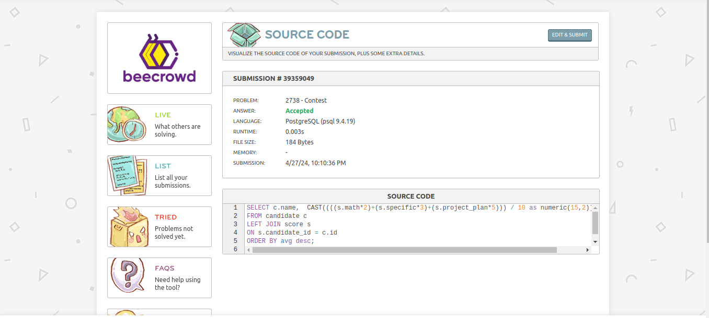

# Solucionar os problemas propostos com queries SQL parte 1

### Endereço dos Clientes (problema - 2603)


```SQL
    select name, street from customers 
    where city = 'Porto Alegre';
```
### Nenhuma Locação (problema - 2616)


```SQL
    SELECT c.id, c.name
    FROM customers c
    LEFT JOIN locations l
    ON c.id = l.id_customers
    WHERE l.id IS NULL
    ORDER BY c.id;
```

### Concurso (problema - 2738)


```SQL
    SELECT c.name,  CAST((((s.math*2)+(s.specific*3)+(s.project_plan*5))) / 10 as numeric(15,2)) as avg
    FROM candidate c
    LEFT JOIN score s
    ON s.candidate_id = c.id
    ORDER BY avg DESC;
```