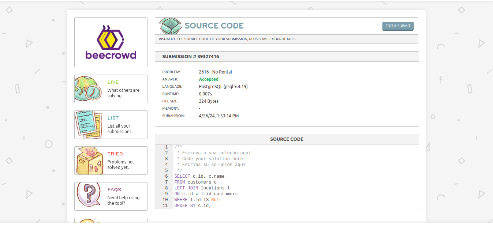

# Solucionar os problemas propostos com queries SQL parte 1

### Endereço dos Clientes (problema - 2603)


```SQL
    select name, street from customers 
    where city = 'Porto Alegre';
```
### Nenhuma Locação (problema - 2616)


```SQL
    SELECT c.id, c.name
    FROM customers c
    LEFT JOIN locations l
    ON c.id = l.id_customers
    WHERE l.id IS NULL
    ORDER BY c.id;
```