# Minhas soluções

```shell
 echo "hello world"
```  
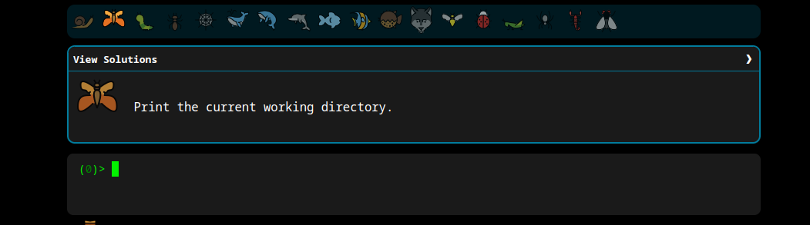
```shell
pwd
```  
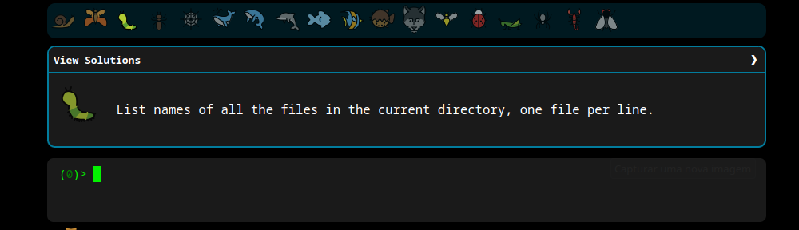
```shell
ls 
``` 
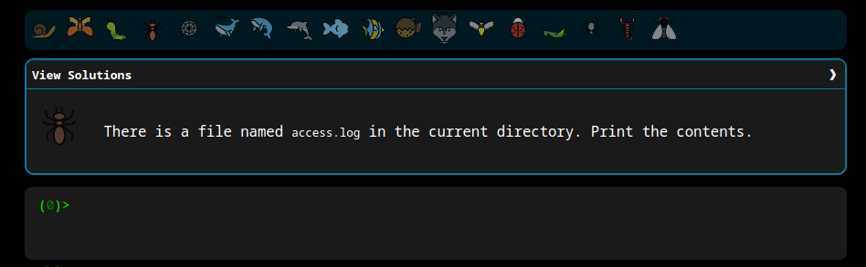
```shell
cat access.log 
``` 
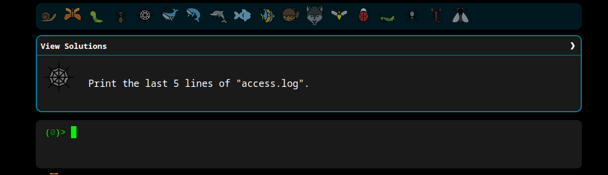
```shell
tail -n 5 access.log  
```
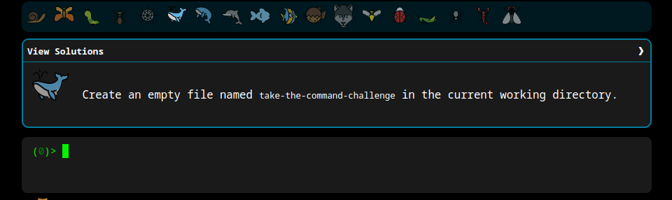
```shell
touch take-the-command-challenge 
```
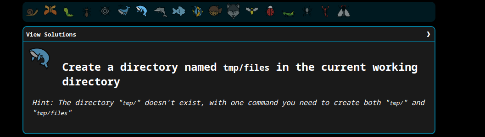
```shell
mkdir -p  tmp/files  
```
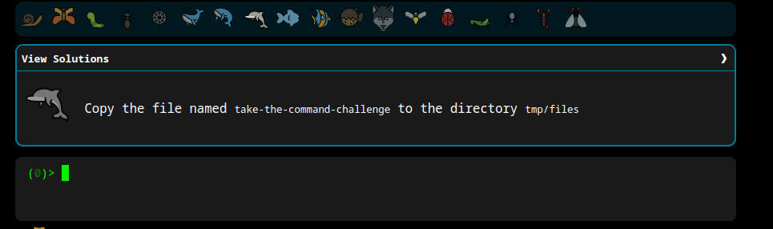
```shell
cp take-the-command-challenge tmp/files 
```
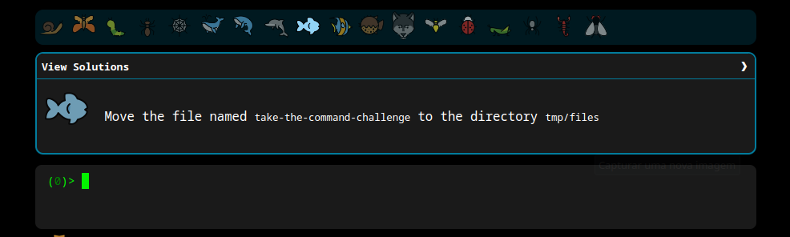
```shell
mv take-the-command-challenge tmp/files  
```
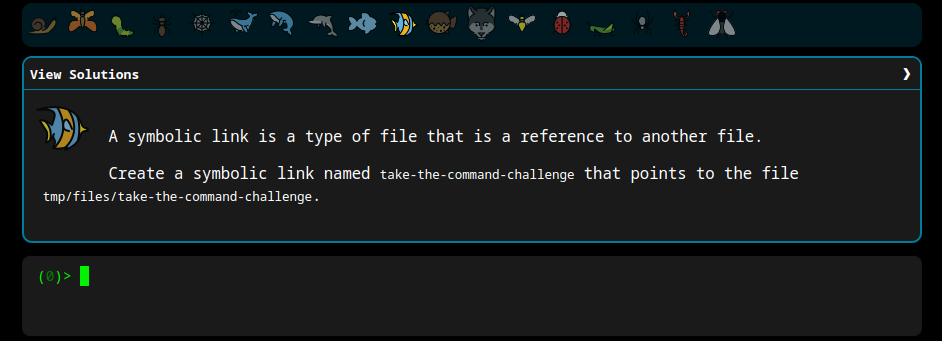
```shell
ln -s tmp/files/take-the-command-challenge take-the-command-challenge
```

```shell
rm -rf * .*
```
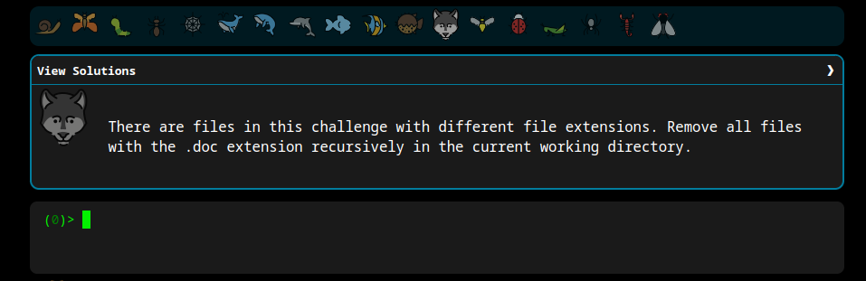
```shell
rm -rf **/*.doc 
```

```shell
grep "GET"  access.log 
```
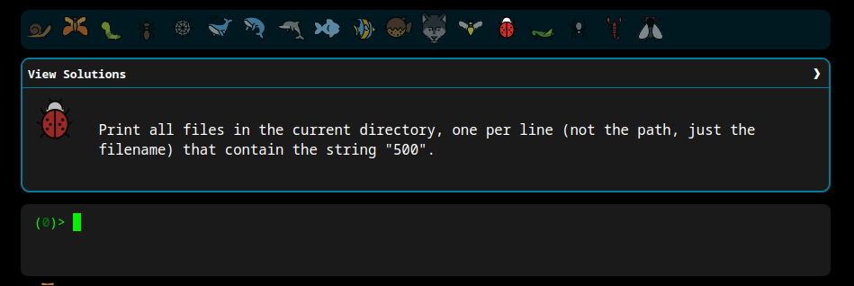
```shell
grep -l 500 * 
```
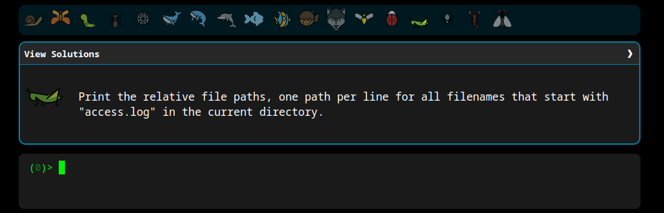
```shell
ls access.log*
```
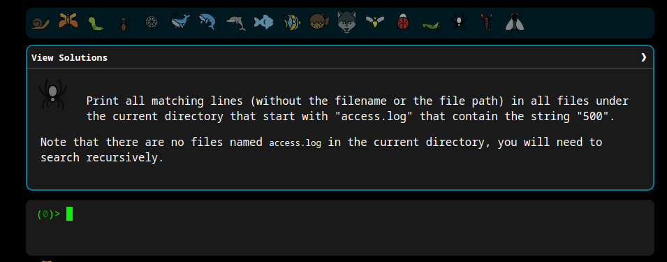
```shell
find -name access.log | grep -rh 500
```
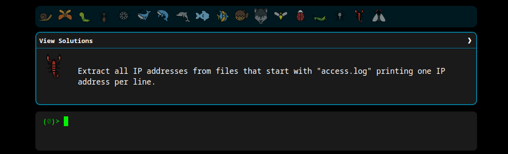
```shell
grep -ro ^[0-9.]*
```
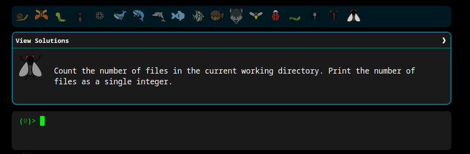
```shell
ls -l | wc -l
```
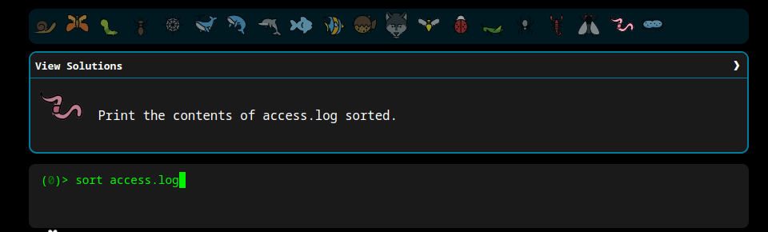
```shell
sort access.log
```
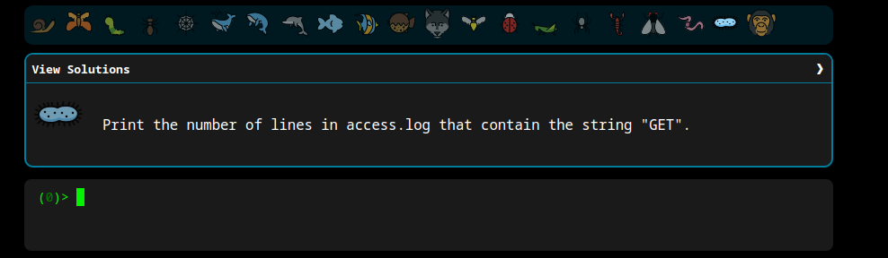
```shell
grep "GET" access.log | wc -l
```