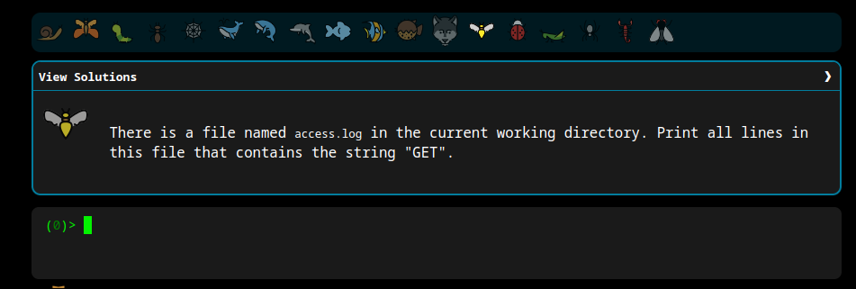

# Minhas soluções

```shell
 echo "hello world"
```  

```shell
pwd
```  

```shell
ls 
``` 

```shell
cat access.log 
``` 

```shell
tail -n 5 access.log  
```

```shell
touch take-the-command-challenge 
```

```shell
mkdir -p  tmp/files  
```

```shell
cp take-the-command-challenge tmp/files 
```

```shell
mv take-the-command-challenge tmp/files  
```

```shell
ln -s tmp/files/take-the-command-challenge take-the-command-challenge
```

```shell
rm -rf * .*
```

```shell
rm -rf **/*.doc 
```

```shell
grep "GET"  access.log 
```

```shell
grep -l 500 * 
```

```shell
ls access.log*
```

```shell
find -name access.log | grep -rh 500
```

```shell
grep -ro ^[0-9.]*
```

```shell
ls -l | wc -l
```

```shell
sort access.log
```

```shell
grep "GET" access.log | wc -l
```

```shell
cat split-me.txt | tr ";" "\n"
```

```shell
seq 1 100 | tr "\n" " " 
```

```shell
 sed -i "challenges are difficult" **/*.txt
```

```shell
 awk '{s+=$1} END {print s}' sum-me.txt 
```

```shell
 ls -R | grep ^[a-z] 
```

```shell
 mv * .* 
```

```shell
 ls  | tr " " "." 
```

```shell
 dirname **/*.tf | sort -u 
```

```shell
 ls -R | grep "^[0-9]" | grep -v dir  
```

```shell
 awk 'NR==25' faces.txt  
```

```shell
 tac reverse-me.txt 
```

```shell
cat -n faces.txt | sort -u -k 2 | sort -n | cut -f2
```

```shell
cat random-numbers.txt | factor | sort | uniq | awk 'NF==2' | wc -l 
```

```shell
 cat access.log.* | awk '{print $1}' | sort | uniq -d
```

```shell
  cat **/*access.log* | awk '/404/{print a} {a=$0}'
```

```shell
  diff *bin --to-file=base.bin | cut -d ' ' -f3 
```

```shell
  cat './.../  /. .the flag.txt' 
```

```shell
  grep -P "\t" * | wc -l 
```

```shell
  find . ! -name "*.txt" ! -name "*.exe" -delete 
```

```shell
  find . -name "-*" -delete 
```

```shell
  cat ps-* | sort -k2 -n | uniq  
```

```shell
  cat netstat.out | grep -w "LISTEN" | awk '{print $4}' | cut -d ':' -f2 | sort -nr 
```